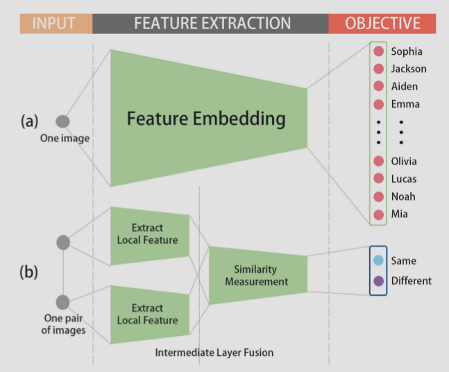

# Fine grain Dog Classification held by Baidu

> author: [cweihang](https://github.com/ahangchen)

Language: [English](README.md)/[简体中文](README_cn.md)
## About
This is a dog classification competition held by Baidu. Competition URL: http://js.baidu.com/

## Framework
- [Keras](https://keras.io/)
- [Tensorflow Backend](https://www.tensorflow.org/)

## Hardware
- Geforce GTX 1060 6G
- Intel® Core™ i7-6700 CPU
- Memory 8G

## Model
- [Xception](https://arxiv.org/abs/1610.02357) for deep feature extraction

[Structure of Xception](doc/large_img.md##Xception)

- Category loss plus Binary loss inspired by [the idea in Person Re-id](https://arxiv.org/abs/1611.05666)

### Implemented in Keras
- Remove the final classify dense layer in Xception to get the deep feature
- Input two images, containing same or different labels
- Train the model with categorical loss of two images and their class labels
- Train the model with binary loss meaning whether two images belong to same class or not

## Data pre-process
- Download the images from Baidu Cloud
  - Training Set: http://pan.baidu.com/s/1slLOqBz Key: 5axb
  - Test set: http://pan.baidu.com/s/1gfaf9rt Key：fl5n
- Place the images with the same class into same directory, for using ImageDataGenerator.
- Because I named the images with the format "typeid_randhash.jpg", I wrote [img2keras.py](preprocess/img2keras.py) for the work described above.
- There are more details to handle. If you meet any error, refer the Keras document first. If you still have some question, you can create an [issue](https://github.com/ahangchen/keras-dogs/issues).

## Training
- Use ImageDataGenerator for data argumentation
- It's hard to find positive samples for binary training using ImageDataGenerator, because the samples are shuffled.
Looking throughout the data set for positive samples is inefficient. Fortunately, in each batch, we can find some samples with the same class.
So we simply swap those samples to construct positive samples.
- Frozen the Xception CNN layers, train the full connected layers for category and binary classification with ADAM
- Unfroze final two blocks(layer 105 to the end) of Xception, continue training with SGD
- Remove data argumentation, retrain until converge

## Code
- Single Xception Model
  - Train: [single_model.py](single/single_model.py)
  - Test: [single_model_test.py](single/single_model_test.py)
- Multi loss Model
  - Froze and fine-tuning: [froze_fine_tune.py](xception/froze_fine_tune.py)
  - Fine tune with some trick: [trick_tune.py](xception/trick_tune.py)
  - Test: [baidu_dog_test.py](xception/baidu_dog_test.py)

## Result
- InceptionV3, softmax loss: 0.2502
- Xception, softmax loss: 0.2235
- Xception, multi loss: 0.211
- Xception, multi loss, fine tune without data argumentation: 0.2045